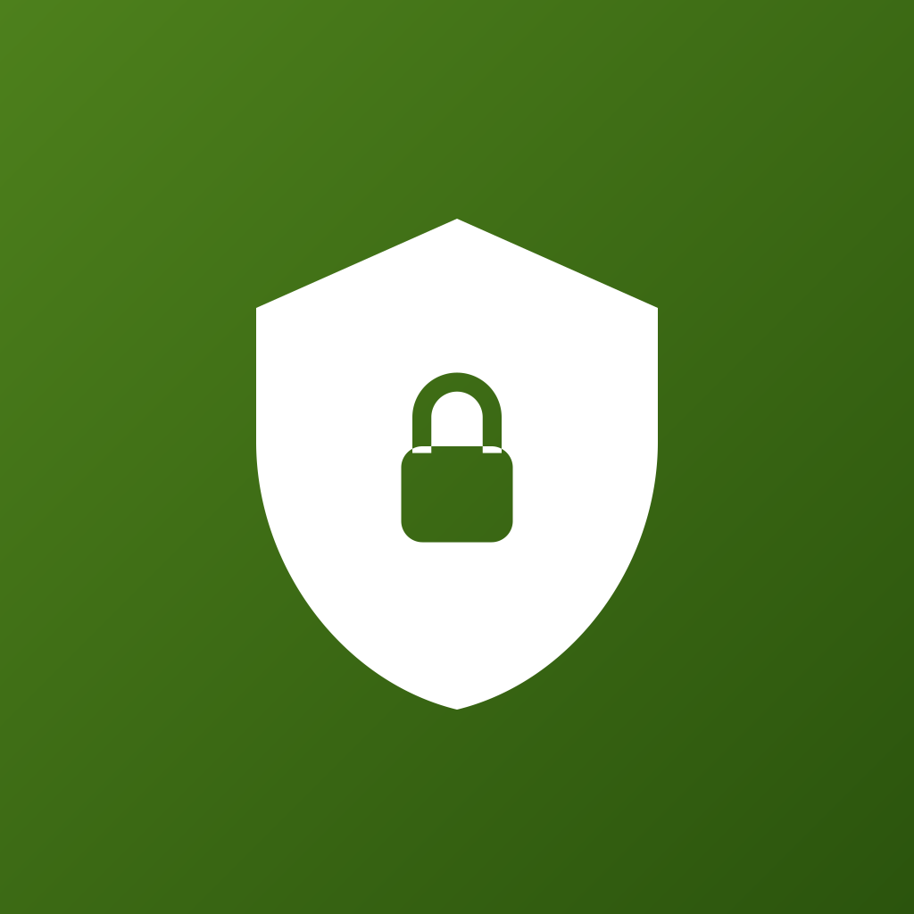

  

<h1 align="center">Pawl</h1>

<b>A gambling blocker you unlock with a physical key.</b>

  
  
  
  

  <a href="https://getpawl.com">Website</a> ·
  <a href="https://apps.apple.com/app/id6783119309">App Store</a> ·
  <a href="https://getpawl.com/privacy.html">Privacy</a> ·
  <a href="SECURITY.md">Report a vulnerability</a>

---

Most blockers can be undone by the same person who set them up, in about
thirty seconds, at exactly the moment they most want to. That is the moment
Pawl is built for.

Pawl blocks sportsbook, casino and other apps and websites you pick, using
Apple's Screen Time. There is no unlock button anywhere in the app. To lift the
block you need a physical FIDO2 security key (a YubiKey, for example) that you
plugged in once and then put somewhere hard to reach: a friend's house, your
car, a drawer at work. Even with the key, you wait fifteen minutes before
anything opens, and the block comes back on by itself.

A real example: it is 1am, the game is on, and you open DraftKings. You see
Pawl's block screen. The key is at your sister's place across town. By the
time you could get it, and then wait out the fifteen minutes, the urge has
usually passed. That is the whole idea.

## Status, plainly

| | |
|---|---|
| Stage | Live on the [App Store](https://apps.apple.com/app/id6783119309), iPhone only. |
| Audit | **None.** Nobody independent has reviewed the code. |
| Team | One developer. No company, no funding, no investors. |
| Platform | iPhone, iOS 18 and later. No Android, no Mac. |
| Backend | Supabase, used only for the optional sponsor features. The solo blocker works with no account. |
| Tracking | No analytics, no ads, no crash reporter. |
| Price | The blocker, the key, the urge tools and the sponsor (approver) side are free. Pawl Pro, a subscription, adds linking your own sponsor and tamper alerts. The Pro code is in this repo too. |

## What it does not promise

Read this before you trust it with anything.

- **iOS lets the owner of a phone turn Screen Time off.** No app can stop
  that. Pawl can only notice it the next time it runs and, if you have a
  sponsor, push them an alert. For a real lock, a sponsor sets the Screen Time passcode in person
  and keeps it (the "hard lock" flow). iOS enforces that passcode, not Pawl.
- **The key check is simple.** Pawl asks iOS for a security key assertion and
  checks that the credential ID matches the key you registered. It does
  **not** verify the assertion's signature. On a normal, non-jailbroken
  iPhone, iOS itself talks to the key, so this proves the key was physically
  there. It is not a cryptographic proof, and it is the first place a reviewer
  should look. See `Pawl/Services/SecurityKeyService.swift`.
- **The clock is not locked yet.** Code to require automatic date and time
  exists (`ShieldService.setClockLock`) but nothing calls it yet. Until it is
  switched on, moving the phone's clock forward may shorten the cooling off
  wait. This has not been tested either way.
- **Debug builds have developer buttons.** "Skip the wait", "simulate
  sponsor approve" and "allow deletion" exist for testing. They sit inside
  `#if DEBUG`, which is only switched on in the Debug build setting, so they
  are not in the App Store build. If you build Pawl yourself in Debug, you
  get them. That is on purpose: it is your own phone.
- **No blocklist is complete.** Pawl ships about 4,000 gambling domains. New
  sites appear every week.
- **A determined person can get around any blocker on a phone they own**
  (another phone, a laptop, a friend's device). Pawl makes the 1am version
  slow. It does not make it impossible.
- **Most of the code has no automated tests.** The unlock loop does. The rest
  was tested by hand on real phones.
- **No reproducible builds.** You cannot prove the App Store binary was built
  from this exact source.

## How it works

1. **Pick what to block.** Apps and websites, through Apple's own Screen Time
   picker. Pawl never learns the names of the apps you pick. Apple hands it an
   opaque token.
2. **Register a security key.** Tap it to your phone once. Then put it
   somewhere that takes real effort to reach.
3. **The shield goes on.** While a commitment is active, Pawl also turns on
   Screen Time's "block app deletion", so you cannot delete Pawl to get out.
4. **When you want out,** you tap the key, then wait out a 15 minute cooling
   off period. You can make the wait longer at any time. Making it shorter is
   itself delayed. After the grace window (30 minutes by default) the shield
   comes back on by itself.
5. **Optional sponsor.** A person you trust links to you with an invite code.
   Then every unlock also needs their approval. They get a push alert if
   Screen Time is turned off, or if your Pawl has not checked in for 24 hours
   (which usually means it was deleted).
6. **Your clean day streak survives deleting the app.** It lives in your
   iCloud, not on the phone.

Relapse is treated as part of recovery. The relapse log is private to you, and
nothing in the app scolds you for using it.

## Where your data goes

| Data | Where it lives | Who can see it |
|---|---|---|
| Which apps and sites you block | Your phone and your iCloud (as Apple's opaque tokens) | You |
| Streak, relapse log, urge log | Your phone and your iCloud | You |
| Your registered key's credential ID | Your phone (the app's shared storage) | You |
| Account, display name, commitment settings | Supabase, only if you sign in | You and your linked sponsor |
| Unlock requests and approvals | Supabase | You and your sponsor |
| Heartbeats and tamper alerts | Supabase | You and your sponsor |

Every Supabase table has row level security turned on. That means the database
itself refuses to hand one person's rows to another. The rules are in
`supabase/schema.sql` and `supabase/migrations/`.

The Supabase URL and "anon" key in `Pawl/SupabaseConfig.swift` are meant to be
public. They are inside every copy of the app anyway. The row level security
rules are what protect the data, not that key.

## Check it yourself

The best thing a stranger can do today is read. Start here:

| File | What |
|---|---|
| `Pawl/Domain/UnlockMachine.swift` | The whole unlock loop, as a pure function with no iOS code |
| `PawlTests/UnlockMachineTests.swift` | 19 tests for that loop |
| `Pawl/Services/SecurityKeyService.swift` | The key check, and its known weakness |
| `Pawl/Services/ShieldService.swift` | Applying and lifting the shield, the app deletion block |
| `Pawl/Services/DurationSettings.swift` | Why making the wait shorter is itself delayed |
| `supabase/schema.sql` | Tables, row level security, server functions |
| `supabase/functions/` | The five server functions, each checks who is calling |

Security fixes are explained in a comment at the spot where they happened.
Search the code for `SECURITY FIX` to find them.

## Where things are

| Path | What |
|---|---|
| `Pawl/Domain/` | Pure logic: the unlock loop, streaks, models |
| `Pawl/Services/` | iOS and backend code: shield, key, iCloud, Supabase, StoreKit |
| `Pawl/Features/` | SwiftUI screens |
| `PawlShield/` | The block screen you see when you open a blocked app |
| `PawlShieldAction/` | The buttons on that block screen |
| `PawlMonitor/` | The Screen Time extension that puts the shield back on schedule |
| `PawlTests/` | Unit tests |
| `supabase/` | Database schema, migrations, server functions |
| `site/` | getpawl.com, static HTML |
| `docs/` | Requirements, design and setup documents |

Some code comments point to planning documents (for example `docs/12` or
`docs/16`) that are not in this repo. Those were business planning notes. The
requirements (`docs/01_SRS_Pawl.md`) and design (`docs/02_SDS_Pawl.md`) are
here.

## Building

You need Xcode 26, an iPhone on iOS 18 or later (Screen Time does not work in
the simulator), and a paid Apple Developer account. Apple must also approve
the Family Controls entitlement for your team before the blocker will run
outside development. The security key needs a domain you own with an
`apple-app-site-association` file; change `PawlConfig.relyingPartyID` to it.
Setup steps are in `docs/04_Xcode_Setup_Checklist.md`,
`docs/05_Security_Key_Setup.md` and, for the backend,
`docs/09_Supabase_APNs_Setup.md` and `docs/10_EdgeFunctions_Push.md`.

Run the tests in Xcode with Product, then Test.

## Contributing

Bug fixes, tests and documentation are welcome. Keep the MPL notice at the top
of every new source file. Anything that touches the user's words on screen
should stay plain and kind: the people using this are having a hard time, and
the app must never shame anyone for a relapse.

A security finding goes to [SECURITY.md](SECURITY.md), not a public issue.

## License

[Mozilla Public License 2.0](LICENSE), the same as
[Seal](https://github.com/jasonepage/Seal). You may read, audit, run and fork
this. Changes to Pawl's own files have to be published under the same license.
MPL rather than GPL on purpose: GPL family licenses conflict with the App
Store's terms, and a blocker that cannot ship on the App Store helps nobody.

**One exception:** most of the gambling blocklist comes from HaGeZi's lists and
stays under GPL-3.0. See [BLOCKLIST_LICENSE.md](BLOCKLIST_LICENSE.md).
