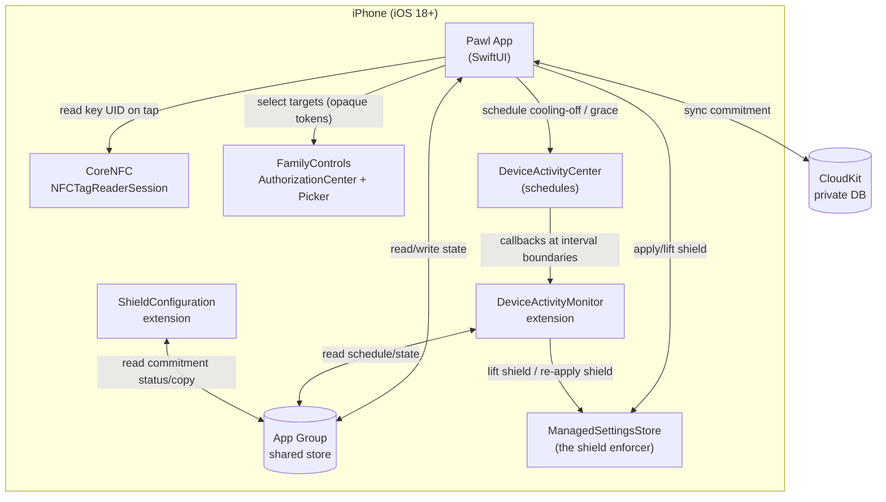
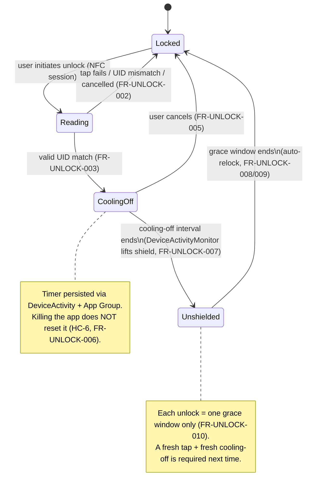
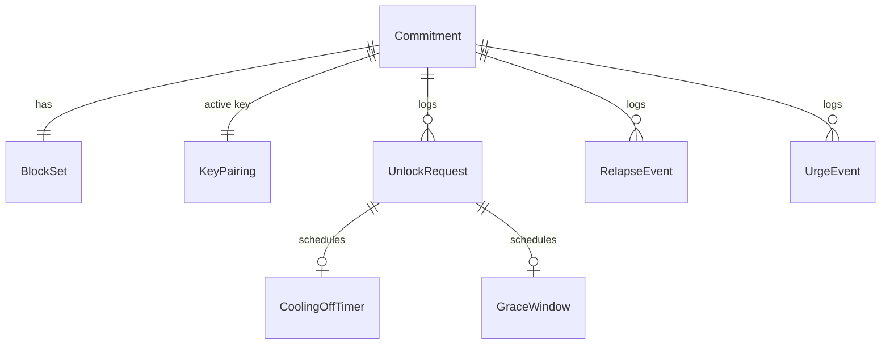
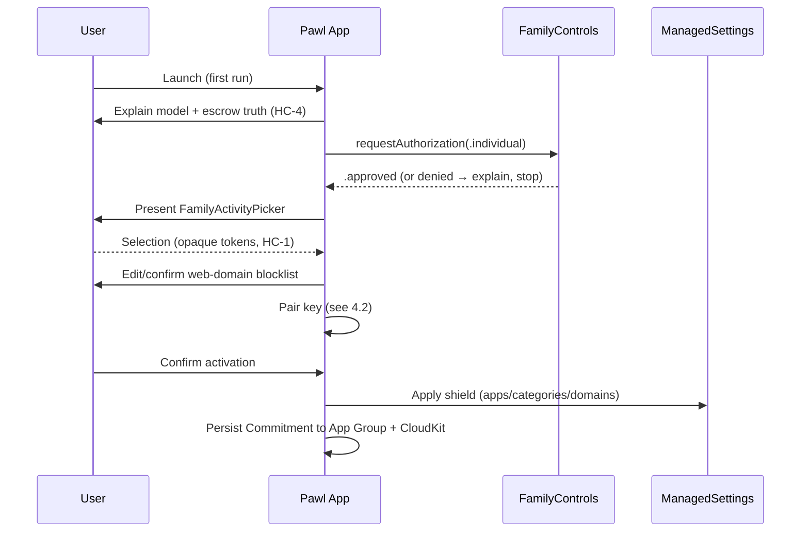
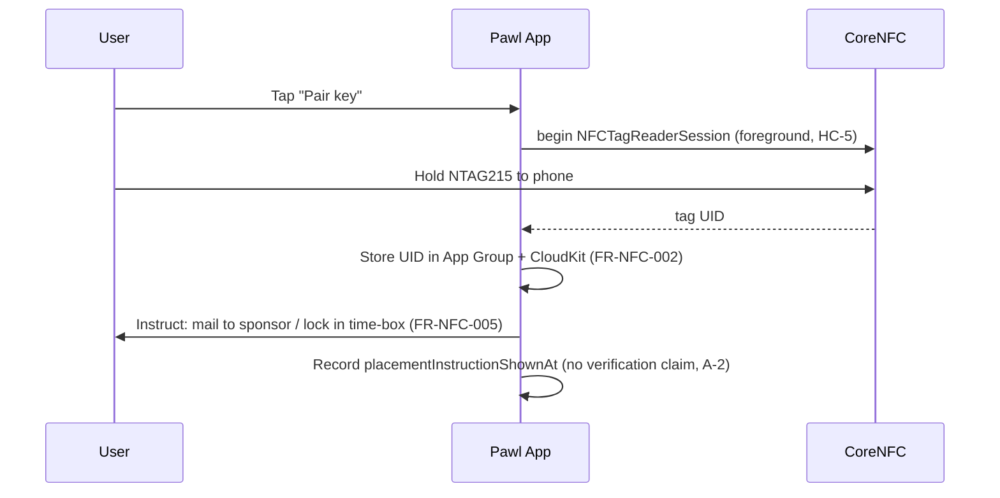
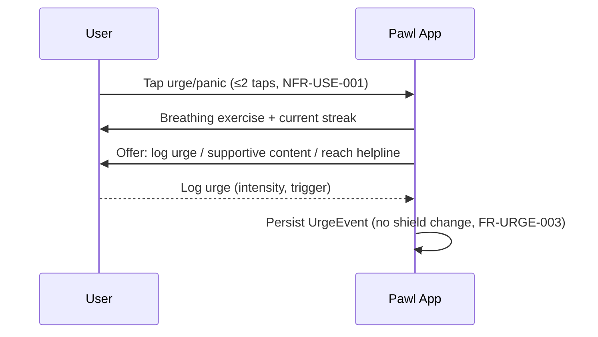
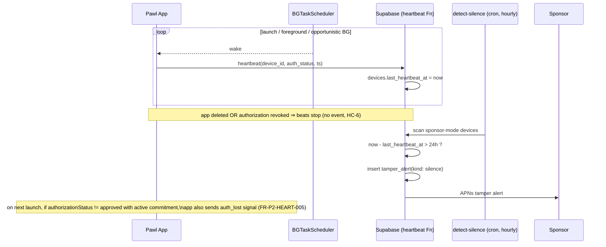
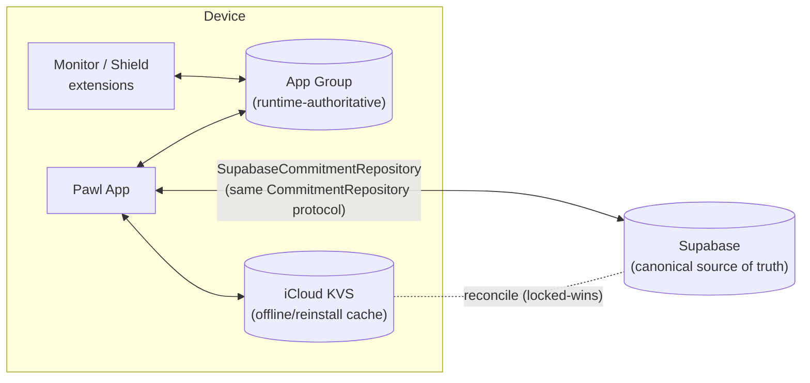

# Software Design Specification — Pawl

**Document status:** Draft v0.1
**Date:** 2026-06-22
**Product name:** Pawl (selected — see Name Sprint, `03_Name_Sprint_Shortlist.md`).
**Scope:** Phase 1 in full; Phases 2–3 stubbed. Traces to `01_SRS_Pawl.md`.
**Platform:** Swift / SwiftUI, iOS 18.0+ (**HC-2**, Decision D2).

> Mermaid diagrams are embedded as fenced ```mermaid blocks; they render on GitHub and in most Markdown viewers. Constraint citations (**HC-1 … HC-7**) and SRS requirement IDs are referenced inline.

---

## 1. Architecture overview

### 1.1 Process & module topology
Pawl is one app target plus two app-extension targets, all sharing an **App Group** container. There is **no server in Phase 1**; the only off-device store is the user's **private CloudKit** container.

- **Pawl App (SwiftUI)** — onboarding, shield management, NFC unlock UI, streak/relapse/urge UI, persistence orchestration.
- **DeviceActivityMonitor extension** — receives scheduled `DeviceActivity` callbacks to enact the cooling-off completion (lift shield) and the grace-window expiry (auto-relock) even when the app is not foregrounded (**HC-6**).
- **ShieldConfiguration extension (`ManagedSettingsUI`)** — renders the custom block screen for shielded targets; presents no unlock control (SRS FR-SHIELD-007/008).
- **App Group container** — shared, authoritative local state (commitment, paired key UID, timer schedule, cached selection tokens) readable/writable by all three targets.
- **CloudKit (private DB)** — durable mirror for reinstall-proofing (SRS §3.7).



### 1.2 What runs where, and when
- **Configuration & taps** happen in the **app** (foreground) — selection requires the picker UI; NFC reads require foreground, user-initiated sessions (**HC-5**).
- **Time-based transitions** (cooling-off complete → lift; grace expiry → relock) are owned by **`DeviceActivity` schedules** and executed in the **monitor extension**, so they fire without the app running (**HC-6**, SRS FR-UNLOCK-006/009, NFR-REL-002).
- **Shield enforcement** is owned by **`ManagedSettings`**; once set, it persists with no running process (**HC-6**, SRS NFR-REL-001).
- **Block screen** is rendered by the **ShieldConfiguration extension** on demand by the OS.
- **Durability** is CloudKit; the **App Group** store is the fast, authoritative local source the extensions read.

### 1.3 Authoritative-state principle
The **App Group store is the single source of truth at runtime**; CloudKit is its durable mirror. Extensions never call CloudKit on the hot path — they read the App Group. The app reconciles App Group ↔ CloudKit on launch and on significant state changes. This keeps timer/relock logic correct offline and fast inside extensions.

---

## 2. Component design

### 2.1 Main app components
- **OnboardingCoordinator** — drives the SRS §3.8 sequence; gates progress on authorization status.
- **AuthorizationService** — wraps `AuthorizationCenter`; requests `.individual` auth, exposes `authorizationStatus`, and on launch detects the Authorization-Lost state (SRS FR-AUTH-003, edge §6).
- **ShieldService** — wraps a `ManagedSettingsStore`; applies/lifts shields for application tokens, category tokens, and web domains (SRS FR-SHIELD-005/010). Single store instance, named, shared via App Group.
- **SelectionStore** — holds/persists `FamilyActivitySelection` (opaque tokens only) and the web-domain blocklist (SRS FR-SHIELD-002/003, NFR-PRIV-001).
- **NFCService** — manages `NFCTagReaderSession`; performs pairing reads and unlock reads; extracts and compares tag UID (SRS §3.3, FR-UNLOCK-001/002). Foreground-only (**HC-5**).
- **UnlockStateMachine** — the heart of the loop (see §2.4).
- **TimerScheduler** — wraps `DeviceActivityCenter`; registers the cooling-off interval and the grace-window interval; persists schedule metadata to the App Group (SRS FR-UNLOCK-006/009).
- **CommitmentRepository** — repository interface over local (App Group) + CloudKit stores (SRS NFR-MAINT-001); the only component features talk to for persistence.
- **StreakService / RelapseLog / UrgeLog** — domain logic for SRS §3.5–3.6.
- **CopyProvider** — centralizes non-judgmental, honest copy (SRS FR-STREAK-005, NFR-USE-003, FR-PERSIST-006).

### 2.2 DeviceActivityMonitor extension
- Implements `intervalDidStart` / `intervalDidEnd` / `eventDidReachThreshold` for two named schedules:
  - **`coolingOff`** — at `intervalDidEnd`, lifts the shield (clears `ManagedSettingsStore` shield props) and starts the `graceWindow` schedule (SRS FR-UNLOCK-007).
  - **`graceWindow`** — at `intervalDidEnd`, re-applies the shield (auto-relock) and records the relock event (SRS FR-UNLOCK-008).
- Reads all needed parameters (which tokens/domains, durations) from the App Group; writes resulting state back so the app reflects reality on next foreground (**HC-6**).

### 2.3 ShieldConfiguration extension
- Provides a `ShieldConfiguration` for shielded apps/categories/domains: title, subtitle ("Locked by Pawl — unlocking needs your physical key + a {N}-minute wait"), brand styling, and **no primary/secondary button that lifts the shield** (SRS FR-SHIELD-008). Reads current status text from the App Group so the screen can reflect "cooling-off in progress" vs "locked".

### 2.4 Unlock state machine
States and transitions (SRS §3.4):



Key design rules: a tap authorizes exactly one cooling-off→grace cycle (FR-UNLOCK-010); decreasing cooling-off duration or re-pairing the key are themselves unlock-class actions gated by the current cooling-off (FR-UNLOCK-004, FR-NFC-004); tightening (adding targets) is always free (FR-SHIELD-009).

### 2.5 Persistence layer
`CommitmentRepository` exposes CRUD for the entities in §3 and hides two backends behind one interface:
- **LocalStore** — App Group-backed (e.g., a file/`UserDefaults(suiteName:)`/lightweight store) holding the authoritative runtime state the extensions read.
- **CloudStore** — CloudKit private DB; best-effort sync, conflict resolution last-writer-wins on a per-record `updatedAt`, except the **commitment-active flag and shield definition are sticky toward "more locked"** (a stale unlocked record never overrides an active local shield) — this enforces SRS FR-PERSIST-003.

---

## 3. Data model

### 3.1 Entities (logical)
| Entity | Key fields | Notes |
|---|---|---|
| **Commitment** | id, status (active/inactive), startedAt, coolingOffSeconds, graceSeconds, updatedAt | One active commitment per user in P1. |
| **BlockSet** | id, commitmentId, applicationTokens (opaque), categoryTokens (opaque), webDomains[] | Tokens are `FamilyActivitySelection` data — never resolved to identities (**HC-1**). |
| **KeyPairing** | id, commitmentId, tagUID, pairedAt, placementInstructionShownAt | One active key per commitment (SRS FR-NFC-003). |
| **UnlockRequest** | id, commitmentId, requestedAt, tapResult, coolingOffStartedAt, completedAt, cancelledAt, outcome | One row per unlock attempt (SRS FR-UNLOCK-011). |
| **CoolingOffTimer** | id, unlockRequestId, endsAt, deviceActivityName | Mirrors the scheduled interval; survives app death (**HC-6**). |
| **GraceWindow** | id, unlockRequestId, endsAt, deviceActivityName | Drives auto-relock. |
| **RelapseEvent** | id, commitmentId, occurredAt, note?, amount? | Resets streak (SRS FR-STREAK-003). |
| **UrgeEvent** | id, commitmentId, occurredAt, intensity?, trigger?, note? | Never lifts shield (SRS FR-URGE-003). |
| **Streak** | derived | Computed from startedAt + last RelapseEvent (SRS FR-STREAK-001); not stored as truth. |



### 3.2 CloudKit schema (Phase 1)
Private database, custom zone `CommitmentZone` (enables atomic-ish batch fetch on reinstall).
- **Record types** mirror the entities above (`Commitment`, `BlockSet`, `KeyPairing`, `UnlockRequest`, `RelapseEvent`, `UrgeEvent`). Timers are runtime-local (App Group) and re-derived from `UnlockRequest` on launch; they need not be CloudKit records.
- **`BlockSet.applicationTokens` / `categoryTokens`** stored as archived `FamilyActivitySelection` data blobs (opaque; **HC-1**, NFR-PRIV-001/002).
- **`KeyPairing.tagUID`** stored as a string/data; this is the only "credential" and is low-sensitivity given the UID threat model (**HC-7**, NFR-SEC-002).
- All records carry `updatedAt`; sync conflict policy per §2.5 (locked-wins for commitment/shield).
- **No public database, no sharing** in P1 (sponsor sharing arrives in P2).

### 3.3 Supabase schema (Phase 2)

> Promoted from stub on 2026-06-22. **Supabase is the canonical source of truth** for account/commitment/accountability data (Decision D-P2-1); the App Group stays runtime-authoritative for the live shield and iCloud KVS is retained as the offline/reinstall cache (see §4.8). Runnable DDL + RLS + RPCs: **`supabase/schema.sql`**. Traces SRS §6.1.

**Tables** (all with RLS enabled; `id uuid`, `created_at`, `updated_at` unless noted):

| Table | Key columns | Owner / who can read |
|---|---|---|
| `profiles` | `id` = `auth.users.id`, `display_name` | self; a linked counterpart can read display name |
| `sponsor_links` | `user_id`, `sponsor_id?`, `invite_code`, `status` (pending/active/revoked), `expires_at`, `accepted_at` | `user_id` (full); `sponsor_id` (read) — redemption via RPC |
| `commitments` | `user_id`, `status`, `started_at`, `cooling_off_seconds`, `grace_seconds`, `sponsor_mode` | self (full); linked sponsor (read) |
| `block_sets` | `commitment_id`, `selection_token_data bytea` (opaque, **HC-1**), `web_domains text[]` | self only (sponsor does **not** read) |
| `unlock_requests` | `commitment_id`, `user_id`, `requested_at`, `status` (pending/approved/denied/expired/cancelled), `decided_by`, `decided_at`, `cooling_off_ends_at`, `grace_ends_at`, `outcome` | self (full); linked sponsor (read); decision via RPC |
| `heartbeats` | `user_id`, `device_id`, `sent_at`, `auth_status` | self only (append); detection by service role |
| `tamper_alerts` | `user_id`, `kind` (silence/auth_lost), `detected_at`, `resolved_at`, `notified` | self + linked sponsor (read); insert by service role |
| `devices` | `user_id`, `apns_token`, `platform`, `last_heartbeat_at` | self only |
| `webauthn_credentials` | `user_id`, `credential_id bytea`, `public_key bytea`, `sign_count` | self only (optional, FR-P2-WAUTH-*) |
| `relapse_events`, `urge_events` | `commitment_id`, `occurred_at`, notes… | **self only — never sponsor-readable** (FR-P2-PRIV-001) |

**Deviations from the §3.3 sketch:** the sketch's `users`/`sponsors`/`approvals` are folded — `users`→Supabase `auth.users` + `profiles`; `sponsors` is not a separate identity (anyone can be a sponsor) but the relation `sponsor_links`; `approvals` are recorded inline on `unlock_requests` (the immutable attempt log already exists in the domain `UnlockRequest`), with the decision applied by RPC.

**RLS pattern (least privilege):**
- Owner policies: `auth.uid() = user_id` for read/write on a user's own rows.
- Sponsor read policies: `commitment.user_id IN (SELECT user_id FROM sponsor_links WHERE sponsor_id = auth.uid() AND status = 'active')`.
- Writes a sponsor must make (redeem invite, approve/deny) go through **`SECURITY DEFINER` RPCs** (`redeem_invite(code)`, `decide_unlock(request_id, approved)`) so a sponsor never holds direct write grants on the user's rows.
- Private journal (`relapse_events`, `urge_events`) and `block_sets` are **owner-only** — no sponsor read policy (FR-P2-PRIV-001, **HC-1**).

**Edge Functions (Deno):**
- `unlock-request-notify` — on new `unlock_request`, APNs-push the linked sponsor.
- `decide-unlock` — invoked by the sponsor's approve/deny (RPC wrapper); APNs-push the user.
- `heartbeat` — authenticated ingest; updates `devices.last_heartbeat_at`, appends `heartbeats`.
- `detect-silence` — **scheduled** (pg_cron / scheduled function, hourly); flags sponsor-mode devices silent > threshold (default 24h), inserts `tamper_alerts`, APNs-pushes the sponsor (**HC-6**).
- `(optional)` `webauthn-verify` — server-side assertion verification (FR-P2-WAUTH-*).

**APNs:** pushes for unlock requests (→ sponsor), approvals/denials (→ user), tamper alerts (→ sponsor). APNs auth key (.p8) stored in Edge Function secrets.

---

## 4. Key flows

### 4.1 Onboarding & shield setup (SRS §3.1, §3.2, §3.8)


### 4.2 NFC key pairing (SRS §3.3)


### 4.3 Unlock flow with cooling-off (SRS §3.4) — the core
```mermaid
sequenceDiagram
  participant U as User
  participant A as Pawl App
  participant N as CoreNFC
  participant DA as DeviceActivity
  participant DAM as Monitor ext
  participant MS as ManagedSettings
  U->>A: Initiate unlock
  A->>N: NFCTagReaderSession (foreground tap, HC-5)
  N-->>A: tag UID
  A->>A: UID == paired? (FR-UNLOCK-002)
  alt mismatch / fail / cancel
    A->>U: Reject; shield stays active
  else valid
    A->>DA: schedule coolingOff (endsAt = now + N min)
    A->>A: log UnlockRequest; persist timer (App Group)
    A->>U: Show countdown + Cancel (FR-UNLOCK-005)
    Note over A,DAM: App may be killed; timer persists (HC-6)
    DA-->>DAM: coolingOff intervalDidEnd
    DAM->>MS: Lift shield (FR-UNLOCK-007)
    DAM->>DA: schedule graceWindow (endsAt = now + grace)
    DA-->>DAM: graceWindow intervalDidEnd
    DAM->>MS: Re-apply shield (auto-relock, FR-UNLOCK-008/009)
    DAM->>A: write outcome to App Group
  end
```

### 4.4 Urge / panic (SRS §3.6)


### 4.5 Reinstall recovery (SRS §3.7)
```mermaid
sequenceDiagram
  participant U as User
  participant A as Pawl App (reinstalled)
  participant FC as FamilyControls
  participant CK as CloudKit
  participant MS as ManagedSettings
  U->>A: Open after reinstall
  A->>FC: ensure authorization (.approved)
  A->>CK: fetch CommitmentZone
  CK-->>A: active Commitment + BlockSet + KeyPairing
  A->>MS: Re-apply shield immediately (FR-PERSIST-002/003)
  A->>U: "Your commitment is restored; same key + wait apply"
  Note over A: Reinstall yields NO friction reduction (FR-PERSIST-003)
```

### 4.6 (P2) Sponsor approval — stacked before cooling-off (SRS §6.1.3)
Approval **stacks before** the wait (Decision D-P2-3): a valid tap does not start the 15-min
timer; the timer begins only on approval. Deny/timeout → stays Locked. The `UnlockMachine`
adds `.awaitingApproval`, `.sponsorDecision(approved:)`, `.approvalTimedOut`, and the effect
`.requestSponsorApproval` (FR-P2-SPON-002..006). The cooling-off/grace legs still run on the
OS-owned `DeviceActivity` window, unchanged from P1.

```mermaid
sequenceDiagram
  participant U as User
  participant A as Pawl App (UnlockMachine)
  participant SK as SecurityKey
  participant SB as Supabase (Edge Fn)
  participant S as Sponsor
  participant DA as DeviceActivity
  participant MS as ManagedSettings
  U->>A: Initiate unlock
  A->>SK: assert() — prove key present (HC-5)
  SK-->>A: credentialID == paired? (FR-UNLOCK-002)
  alt mismatch / cancel
    A->>U: Reject; shield stays active
  else valid key
    A->>A: state → awaitingApproval; effect requestSponsorApproval
    A->>SB: create unlock_request (pending)
    SB->>S: APNs push (Approve / Deny)
    alt sponsor approves (within window, default 60 min)
      S->>SB: decide_unlock(approved: true)  [RPC]
      SB->>A: APNs → sponsorDecision(approved: true)
      A->>DA: schedule coolingOff (now + N min)   %% wait starts ONLY now
      A->>U: Show countdown + Cancel (FR-UNLOCK-005)
      DA-->>MS: intervalDidEnd → lift shield (FR-UNLOCK-007)
      DA-->>MS: graceWindow end → re-apply shield (auto-relock, FR-UNLOCK-008/009)
    else sponsor denies
      S->>SB: decide_unlock(approved: false) [RPC]
      SB->>A: APNs → sponsorDecision(approved: false)
      A->>U: Stays Locked; shield untouched (FR-P2-SPON-004)
    else no response → expire
      SB->>SB: window elapsed → status = expired
      SB->>A: APNs → approvalTimedOut
      A->>U: Stays Locked (fail-safe, FR-P2-SPON-005)
    end
  end
```

### 4.7 (P2) Heartbeat / tamper alert (SRS §6.1.4)
There is **no OS event** on delete/revoke (**HC-6**); detection is by **silence**. Beats are
opportunistic (BGTaskScheduler + launch/foreground); the threshold (default 24h) is deliberately
slack to tolerate iOS background throttling and avoid false alarms (Decision D-P2-4).



### 4.8 (P2) Source of truth, sync, and the client↔server split
**Authoritative-state principle is unchanged (§1.3):** the **App Group** store is runtime-authoritative
for the live shield/timer because the `DeviceActivityMonitor`/`ShieldConfiguration` extensions read it
on the hot path and **must not** take a network dependency (**HC-6**, NFR-REL-002, FR-P2-SYNC-002).
"Supabase-first" therefore means Supabase is the **canonical cloud store** everything reconciles to —
*not* that the shield calls the network.

Three stores, by role:
- **App Group (local, runtime-authoritative):** active selection tokens, phase, scheduled window. Read by extensions; never networked.
- **Supabase (canonical cloud, source of truth):** account, profile, commitment definition, sponsor links, unlock requests + decisions, heartbeats, tamper alerts, devices, (optional) WebAuthn credentials.
- **iCloud KVS (offline + reinstall cache):** retained so reinstall-proofing (FR-PERSIST-002/003) works **without** network or sign-in; reconciled to Supabase when a session is available.

Conflict policy: **locked-wins is preserved** (`CommitmentReconciler`) across all three — a stale *unlocked* record never overrides an active shield (FR-PERSIST-003, FR-P2-SYNC-004).



**Repository seam:** a new `SupabaseCommitmentRepository: CommitmentRepository` (FR-P2-SYNC-005) is composed with the existing `CloudCommitmentRepository` (iCloud KVS). Feature code keeps talking only to the `CommitmentRepository` protocol (NFR-MAINT-001); the composite writes through to Supabase when signed in and always to the App Group + iCloud cache.

**What runs where:**
- **Client (Swift):** Sign in with Apple → Supabase session; APNs registration; the `UnlockMachine` approval gate; BGTaskScheduler heartbeats; surfacing sponsor/tamper notifications. Shield/timer enforcement stays local (HC-6).
- **Server (Supabase):** Auth + RLS; invite redemption + unlock decision RPCs; Edge Functions for APNs fan-out and scheduled silence detection; (optional) WebAuthn verification. Tamper detection lives **only** server-side (HC-6).

---

## 5. Security & privacy design

### 5.1 Token opacity
The app only ever holds `FamilyActivitySelection` tokens; it cannot and does not resolve them to app/developer identities, and persists them as opaque archived blobs (**HC-1**, SRS NFR-PRIV-001/002). No analytics on shielded identities are possible or attempted.

### 5.2 App Group data
Shared state lives in the App Group container, protected by iOS data protection. Extensions read it on the hot path; no secrets beyond the tag UID are stored. The UID is low-sensitivity (it authorizes nothing without physical possession of the tag).

### 5.3 Escrow limitations (state the truth — **HC-4**)
The design explicitly encodes the two-lock reality:
- The **`ManagedSettings` shield is strong**: not removable from iOS Settings, persists without the app running, re-applied on reinstall.
- The **escape hatches** (delete app, revoke Family Controls authorization) **wipe shields** and emit **no event** (**HC-6**). The app cannot prevent them and **cannot set the Screen Time passcode** that would. Onboarding/security copy states this plainly (SRS FR-PERSIST-006, NFR-SEC-001). The only true closure is the **Phase 3 sponsor-set passcode**.
- The NFC key's role is to (a) gate the unshield and (b) be the physical object the user escrows — **not** a Screen Time substitute.

### 5.4 Threat model (Phase 1)
| Threat | Vector | P1 mitigation | Residual / later phase |
|---|---|---|---|
| Impulsive in-app unlock at 1am | User taps unlock | NFC key must be physically present + cooling-off + auto-relock (FR-UNLOCK-*) | If key is reachable, friction is weak — depends on escrow (A-2) |
| Shorten the wait | Reduce cooling-off / re-pair easy key | Treated as unlock-class actions, gated (FR-UNLOCK-004, FR-NFC-004) | — |
| Delete app | Removes shields | Reinstall re-applies shield from CloudKit (FR-PERSIST-002); honest disclosure | Not closable in P1 (HC-4/6); P3 passcode + P2 tamper alert |
| Revoke authorization | Settings → wipe shields | Detected on next launch via `authorizationStatus` (FR-AUTH-003); honest disclosure | No real-time detection in P1; P2 heartbeat; P3 passcode |
| Forge/swap NFC tag | Use a different tag | UID match required (FR-UNLOCK-002) | UID not cryptographic (HC-7); accepted — physical placement is the real control |
| Reinstall to reset | Fresh install | Sticky "locked-wins" sync; restored commitment (FR-PERSIST-003) | — |

The honest summary the product must never hide: **Phase 1 protects strongly against the impulsive in-app unlock, and is defeatable by a determined user via delete/revoke until the Phase 3 passcode tier.** This is by design and disclosed.

---

## 6. Error & edge handling

- **EDGE-AUTH (FR-AUTH-003):** authorization revoked → on launch, detect non-`.approved` with an active commitment, enter **Authorization-Lost** state: surface a clear "protection is down, re-grant to restore" screen, re-apply shield once re-approved, log the lapse. No false sense of safety.
- **EDGE-NFC:** read failure / wrong tag / session timeout → report failure, keep current state, never partial-unlock (FR-NFC-006, FR-UNLOCK-002).
- **EDGE-LOSTKEY:** lost/forgotten key → recovery path is itself unlock-class (re-pair gated by cooling-off, FR-NFC-004); P2+ may add sponsor-assisted recovery. Document that an easily-available replacement key undermines the model.
- **EDGE-TIMER:** app killed during cooling-off/grace → `DeviceActivity` schedule still fires in the monitor extension; on next foreground the app reconciles displayed state from App Group (FR-UNLOCK-006, NFR-REL-002).
- **EDGE-ICLOUD:** iCloud unavailable → local-only commitment works; warn that reinstall-proofing is degraded; sync when available (FR-PERSIST-005).
- **EDGE-MIGRATION:** new device → CloudKit restores the commitment definition, but the user must re-pair the physical key on the new device (UID read is device-local action); treat re-pair as gated and instruct re-escrow.
- **EDGE-RELOCK-RACE:** user foregrounds exactly at grace expiry → monitor extension is authoritative; app must not assume "unshielded" without reading App Group state.

---

## 7. Testing strategy hooks, build/release notes, entitlement dependency

### 7.1 Testing hooks
- **Time abstraction:** inject a clock so cooling-off/grace can be tested without real waits; integration tests exercise real `DeviceActivity` boundaries on device.
- **Shield verification:** test harness asserts `ManagedSettingsStore` shield properties are set/cleared at each state transition (SRS NFR-REL-001/004).
- **Persistence:** simulate reinstall by clearing App Group + re-fetching CloudKit; assert shield re-applied and no friction reduction (FR-PERSIST-003).
- **Authorization-lost:** simulate `authorizationStatus` flips; assert Authorization-Lost UI and recovery.
- **NFC:** abstract the reader so UID match/mismatch is unit-testable; manual device tests for real NTAG215 reads (**HC-5**).
- **Extensions:** unit-test the monitor's interval handlers against App Group fixtures; verify the ShieldConfiguration exposes no lift control.
- See `engineering:testing-strategy` for a fuller plan when implementation begins.

### 7.2 Build / target structure
- Targets: `Pawl` (app), `PawlMonitor` (`DeviceActivityMonitor`), `PawlShield` (`ManagedSettingsUI`/`ShieldConfiguration`). Shared Swift package for domain models + repository. App Group `group.<bundle-id>` enabled on all three.
- Capabilities: Family Controls, App Groups, iCloud (CloudKit), Near Field Communication Tag Reading.

### 7.3 Entitlement dependency (**HC-3 / A-1**) — schedule as a hard gate
- The **Family Controls (Distribution) entitlement** must be requested from Apple and approved for this self-control use case. Development can proceed under the development entitlement, but **TestFlight/App Store distribution is blocked until approval**. Apply at project start; treat approval as a milestone on the critical path. If denied, the product is not shippable as specified — escalate immediately.

---

## 8. Open items affecting design
- **D4 (pricing)** → shapes P3 stakes/SKU components; no P1 design impact.
- **Naming** → bundle id / App Group id / App Store name; choose before TestFlight. P1 code uses the codename.
- **Sponsor model** → P1 stays solo-first (D1). **Phase 2 decisions confirmed 2026-06-22** (Supabase-first source of truth; Sign in with Apple + invite code; stacked approval; opportunistic heartbeat + 24h silence) — §3.3 schema and §4.6–4.8 flows are now full, not stubs. Roadmap in `08_Phase2_Plan.md`.
